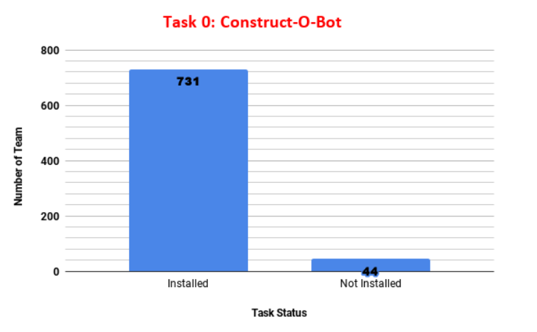
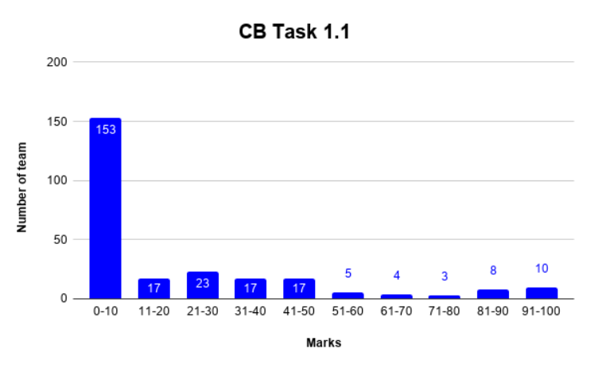
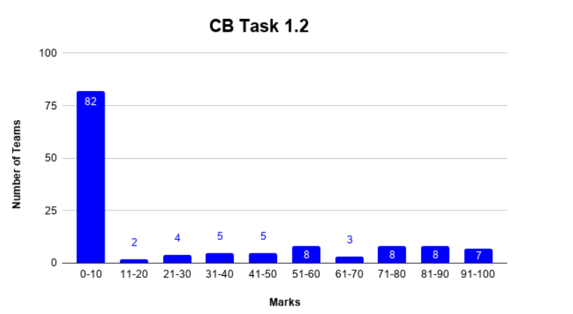
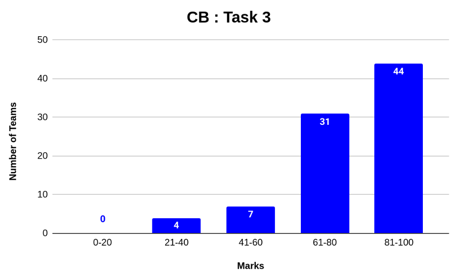
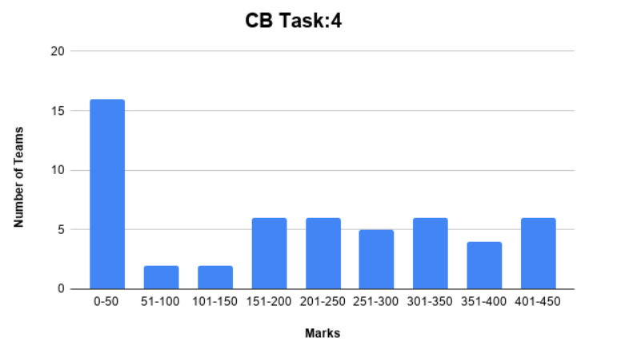

# E-YANTRA 2019-2020 TASK SUBMISSIONS (Team ID - 3469)
## Theme - Construct-o-Bot
Environmental conditions such as extreme rainfall, earthquakes, landslides and floods often cause natural disasters which lead to tremendous loss of life and property, causing great disruption in people’s lives and the economy. In 2018, across the world there were 315 natural disaster events recorded with 11,804 deaths, over 68 millions of people were affected, and 131.7 billion dollars in economic losses.

After a disaster strikes, governments and private organizations engage in reconstruction efforts of infrastructure, such as roads, bridges, power and railway lines, houses etc. This is a very labor and capital-intensive task. Moreover, doing this at a disaster site, with its multiple associated risks and challenging terrain, poses an additional challenge.
Motivated by this scenario, in order to help the needy victims in the affected areas, this edition of e-Yantra Robotics Competition (eYRC 2019-20) presents the theme “Construct-O-Bot”.

In this theme, the arena is an abstraction of a disaster site where the robot picks the construction material and traverses paths in order to deposit it at the site to be reconstructed. In order to maneuver over these paths, the Construct-O-Bot has to use intelligent line-following and path-planning algorithms to reach safely and quickly using shortest paths.
After reaching the site, the Construct-O-Bot carefully has to place the material at the required positions which may include placing the material at different heights from the ground. It has to deposit all required material at multiple construction sites, navigating through various terrains.

The team that finishes the given task in the least amount of time whilst incurring the least penalties will be declared the winner.

# Results
## Task 0

Remark : Visual Studio Installed and V_REP Installed
Passed
## Task 1.1
95/100

Remark : Good Work
## Task 1.2
88/100

Remark : You have picked 7 and placed 2
## Task 2
Remark : Good
## Task 3
88/100

Remark : Good Work
## Task 4
433/380 (30% bonus for early submission)

Remark : Good work, Make your arm sturdy.
# Demo
## Hardware Testing
https://youtu.be/kqlR-GdEUJE

## Robot Testing
https://youtu.be/lDrcOotHkA0

## Task 4
https://youtu.be/vr7ZOj5xuTk

https://youtu.be/OVagyDxdAV0

## Task 5
Original Configuration

https://youtu.be/pC9cgT4azlI

Bonus Configuration

https://youtu.be/SYDLNNLTBhI